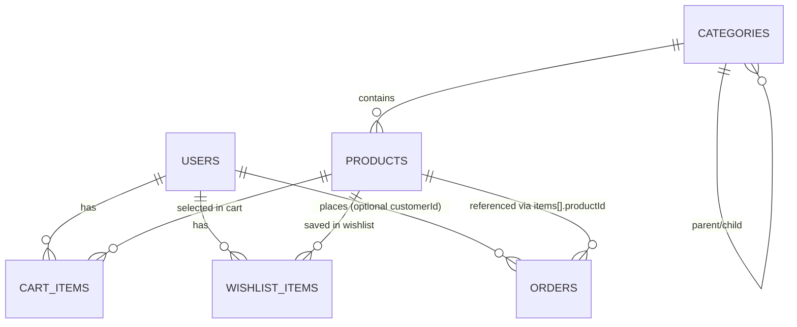

# Convex Database Tables and Relations (Current)

Updated: 2026-02-27  
Source of truth: `convex/schema.ts` + live usage in `convex/*.ts`

## 1. Tables Overview

| Table | Purpose | Key Relation Fields | Key Indexes |
| --- | --- | --- | --- |
| `users` | App users (customer/admin) mapped to Better Auth identity | `betterAuthId` (external auth mapping) | `by_email`, `by_betterAuthId` |
| `categories` | Product taxonomy with optional nesting | `parentId -> categories._id` | `by_slug`, `by_parent`, `by_active` |
| `products` | Product catalog data + embedded color/size variant stock | `categoryId -> categories._id` | `by_slug`, `by_sku`, `by_category`, `by_featured`, `by_active` |
| `cartItems` | Per-user cart selections | `userId -> users._id`, `productId -> products._id`, `colorVariantId` (string, embedded variant ref) | `by_user`, `by_user_product_size` |
| `wishlistItems` | Per-user wishlist selections | `userId -> users._id`, `productId -> products._id`, `colorVariantId` (optional string) | `by_user`, `by_user_product` |
| `orders` | Order headers + immutable line snapshots | `customerId -> users._id` (optional), `items[].productId -> products._id` | `by_orderNumber`, `by_customer`, `by_status`, `by_createdAt` |
| `storeSettings` | Singleton-style store configuration | none | none |
| `_storage` (Convex system) | File storage objects used for product media | referenced by `products.getStorageUrl(storageId)` | Convex internal |

## 2. Table Details

### `users`

- Primary columns: `email`, `name`, `phone?`, `role`, `betterAuthId`, `isActive`, `createdAt`
- Relationship notes:
  - One `users` row can own many `cartItems`, `wishlistItems`, and `orders`.
  - `betterAuthId` links app user row to Better Auth identity records.

### `categories`

- Primary columns: `name`, `slug`, `description?`, `parentId?`, `sortOrder`, `isActive?`, timestamps
- Relationship notes:
  - Self-referencing tree via `parentId`.
  - One category can have many products (`products.categoryId`).

### `products`

- Primary columns:
  - Core: `sku?`, `name`, `slug`, `description`, `categoryId`
  - Pricing/state: `basePrice?`, `salePrice?`, `isFeatured`, `isPublished?`
  - Legacy compatibility: `price?`, `images?`, `sizes?`, `colors?`, `stock?`, `isOutOfStock?`
  - New variant model: `colorVariants?` (embedded array)
- Embedded variant structure (`colorVariants[]`):
  - `id` (string)
  - `colorName`, `colorHex`
  - `images[]`
  - `selectedSizes[]`
  - `stock: Record<size, number>`
  - `measurements: Record<size, { shoulder?, chest?, sleeve?, waist?, length? }>`
- Relationship notes:
  - One product belongs to one category.
  - Cart/wishlist/order line items point to product row; selected variant is a string reference into embedded `colorVariants`.

### `cartItems`

- Primary columns: `userId`, `productId`, `colorVariantId`, `size`, `quantity`, timestamps
- Relationship notes:
  - Many cart rows per user.
  - Composite index `by_user_product_size` is used to upsert/merge same selection.

### `wishlistItems`

- Primary columns: `userId`, `productId`, `colorVariantId?`, `size?`, `addedAt`
- Relationship notes:
  - Many wishlist rows per user.
  - `by_user_product` used to prevent duplicate product entries per user.

### `orders`

- Header columns: `orderNumber`, `customerId?`, `customerInfo`, pricing totals, delivery/payment, status, timestamps
- Line snapshot columns (`items[]`):
  - `productId`, `colorVariantId?`, `name`, `size`, `color`, `quantity`, `price`
- Relationship notes:
  - `customerId` is optional for guest checkout style flows.
  - Order items denormalize name/size/color/price at purchase time (historical snapshot behavior).
  - Stock adjustments are performed against `products.colorVariants[].stock` in order mutations.

### `storeSettings`

- Primary columns: hero banner lines, contact fields, social URLs, `updatedAt`
- Relationship notes:
  - No foreign keys; treated as global settings record.

## 3. Relationship Map

## 4. Important Modeling Notes

- `colorVariantId` is not a foreign key table ID. It is a string key for embedded variant data inside `products.colorVariants`.
- Orders intentionally store product snapshot fields (`name`, `size`, `color`, `price`) so historical orders remain stable even if product catalog data changes later.
- `storeSettings` is singleton-like by usage pattern (querying first row, patching/creating one record).
