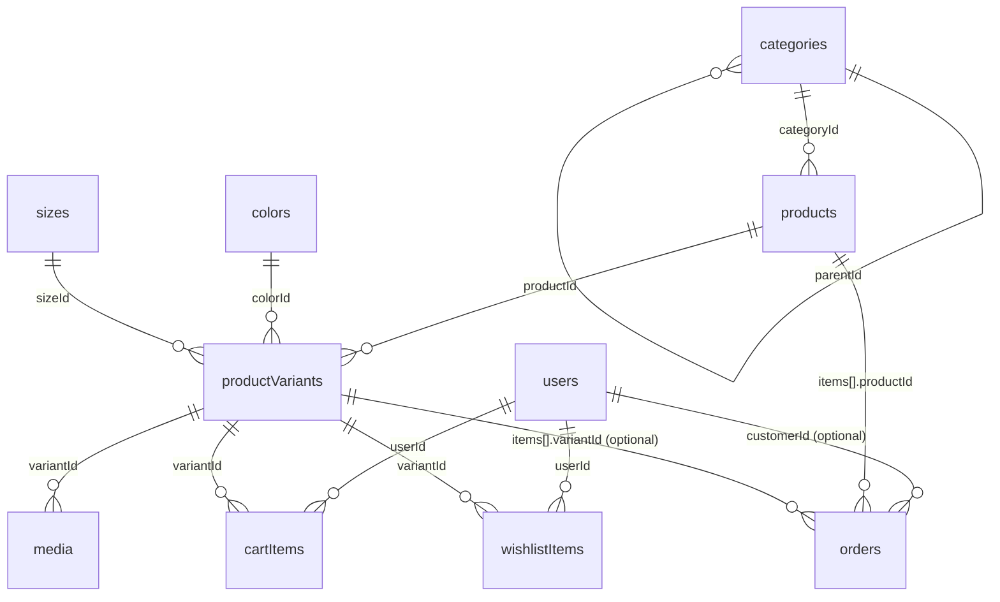

# Current Database Structure, Relationships, and Frontend Connections

Last updated: 2026-02-18
Code source: `local-brand-khit/convex/schema.ts` and current frontend pages/components.

## 1) Architecture Overview

- **Backend DB/API:** Convex (`local-brand-khit/convex/*`)
- **Frontend:** Next.js App Router (`local-brand-khit/src/app/*`)
- **Auth layer:** Better Auth + Convex auth integration
- **Data access from frontend:** `useQuery` / `useMutation` from Convex client
- **Image delivery:** Convex storage IDs are resolved via local proxy route `/api/storage/[id]`

## 2) Current Convex Tables

## Catalog Core

### `categories`
- Fields: `name`, `slug`, `description?`, `parentId?` (self-reference), `sortOrder`, `isActive?`, `createdAt`, `updatedAt`
- Indexes: `by_slug`, `by_parent`, `by_active`

### `products`
- Fields:
  - Core: `sku?`, `name`, `nameMm?`, `slug`, `description`, `descriptionMm?`, `categoryId`
  - Pricing/status: `basePrice?`, `salePrice?`, `isFeatured`, `isPublished?`, `isActive`
  - Extra: `careInstructions?`, `sizeFit?`
  - Legacy compatibility: `price?`, `images?`, `sizes?`, `colors?`, `stock?`, `isOutOfStock?`
  - Timestamps: `createdAt`, `updatedAt`
- Indexes: `by_slug`, `by_sku`, `by_category`, `by_featured`, `by_active`

### `colors`
- Fields: `name`, `nameMm?`, `hexCode`, `displayOrder`, `isActive?`, `createdAt`, `updatedAt`
- Indexes: `by_name`, `by_hexCode`, `by_active`

### `sizes`
- Fields: `name`, `nameMm?`, `sizeCategory`, `displayOrder`, `isActive?`, `createdAt`, `updatedAt`
- Indexes: `by_name`, `by_category`, `by_active`

### `productVariants`
- Fields: `productId`, `colorId`, `sizeId`, `skuVariant`, `priceOverride?`, `stockQuantity`, `displayOrder`, `isPrimary`, `isActive?`, `createdAt`, `updatedAt`
- Indexes: `by_product`, `by_product_color`, `by_product_size`, `by_sku_variant`, `by_active`

### `media`
- Fields: `variantId`, `mediaType` (`image|video`), `filePath`, `fileUrl?`, `thumbnailUrl?`, `altText?`, `displayOrder`, `isPrimary`, `isActive?`, `createdAt`, `updatedAt`
- Indexes: `by_variant`, `by_variant_display`, `by_variant_primary`, `by_active`

## Commerce

### `cartItems`
- Fields: `userId`, `variantId`, `quantity`, `addedAt`, `updatedAt`
- Indexes: `by_user`, `by_user_variant`

### `wishlistItems`
- Fields: `userId`, `variantId`, `addedAt`
- Indexes: `by_user`, `by_user_variant`

### `orders`
- Fields:
  - `orderNumber`, `customerId?`, `customerInfo`
  - `items[]` (each item stores `productId`, `variantId?`, `name`, `size`, `color`, `quantity`, `price`)
  - Totals: `subtotal`, `shippingFee`, `total`
  - Workflow: `deliveryMethod`, `paymentMethod`, `status`, `notes?`
  - Timestamps: `createdAt`, `updatedAt`
- Indexes: `by_orderNumber`, `by_customer`, `by_status`, `by_createdAt`

## Identity

### `users`
- Fields: `email`, `name`, `phone?`, `role` (`customer|admin`), `betterAuthId`, `isActive`, `createdAt`
- Indexes: `by_email`, `by_betterAuthId`

## 3) Relationships

## 4) Data Rules in Current Backend Logic

- `products.getFeatured/getByCategory/getBySlug/filterProducts/searchProducts`:
  - storefront visible products are filtered by:
    - `isActive === true`
    - `isPublished !== false`
- Variant/media hydration for product response:
  - build from `productVariants` + `media`
  - fallback order:
    1. selected variant own media
    2. same-color sibling variant media
    3. any media in product variants
    4. legacy `product.images`
- `media.create` behavior:
  - when admin uploads media for one variant, backend propagates/normalizes for all variants of same `(productId + colorId)`.
- Deletion behavior:
  - `products.remove` = soft delete (`isActive = false` on product + its variants)
  - `categories.remove`, `colors.remove`, `sizes.remove`, `variants.remove`, `media.remove` = hard delete with cascading cleanup where implemented.

## 5) Frontend Connection Map

## Convex Client Bootstrap

- Provider: `local-brand-khit/src/providers/convex-client-provider.tsx`
- Uses: `NEXT_PUBLIC_CONVEX_URL`
- Wrapped in app layout for global `useQuery/useMutation` usage.

## Storefront Pages

- Home `src/app/(store)/page.tsx`
  - `api.products.getFeatured`
- Category listing `src/app/(store)/[category]/page.tsx`
  - `api.products.filterProducts`
- Product detail `src/app/(store)/products/[slug]/page.tsx`
  - `api.products.getBySlug`
  - variant/color/size image selection through `src/lib/product-variants.ts`
- Checkout `src/app/(store)/checkout/page.tsx`
  - `api.orders.create`
- Account `src/app/(store)/account/page.tsx`
  - `api.users.getCurrent`
  - `api.users.upsertCurrentProfile`
- Account orders `src/app/(store)/account/orders/page.tsx`
  - `api.orders.getByCustomer`

## Admin Pages

- Dashboard: `api.orders.getTodayStats`, `api.products.getCount`, `api.products.getLowStock`
- Products: `api.products.getAll/create/update/remove/generateUploadUrl`
- Categories: `api.categories.getActive/create/update/remove`
- Colors: `api.colors.getAll/create/update/remove`
- Sizes: `api.sizes.getAll/create/update/remove`
- Variants: `api.variants.getAll/create/update/remove`
- Media: `api.media.getAll/create/update/remove`, `api.products.generateUploadUrl`
- Orders: `api.orders.getAll`, `api.orders.updateStatus`

## Image URL Resolution Path

- Frontend helper: `src/lib/image.ts`
  - raw storage ID -> `/api/storage/{id}`
- Next route: `src/app/api/storage/[id]/route.ts`
  - resolves signed URL via Convex query `products:getStorageUrl`
  - redirects browser to signed storage URL

## 6) Practical Connection Flow (Product Card / PDP)

1. Frontend loads product with hydrated `variants + media`.
2. User selects color/size.
3. UI resolves selected variant using `getSelectedVariant`.
4. UI resolves image list using `getDisplayImagesForSelection`.
5. If selected variant has no own image, fallback chain keeps product display stable (same-color -> product-level fallback).

This is the current production structure and connection model in the repository now.
