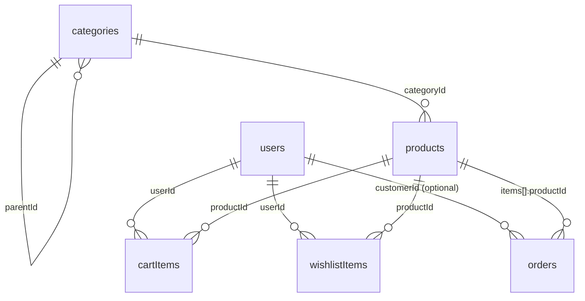

# Current Database Structure, Relationships, and Frontend Connections

Last updated: 2026-02-23
Code source: `local-brand-khit/convex/schema.ts` and current frontend pages/components.

## 1) Architecture Overview

- **Backend DB/API:** Convex (`local-brand-khit/convex/*`)
- **Frontend:** Next.js App Router (`local-brand-khit/src/app/*`)
- **UI & Icons:** Tailwind CSS, shadcn/ui, and **Lucide React** (standardized icon library)
- **Auth layer:** Better Auth + Convex auth integration
- **Data access from frontend:** `useQuery` / `useMutation` from Convex client
- **Image delivery:** Convex storage IDs are resolved via local proxy route `/api/storage/[id]`

## 2) Current Convex Tables

### `users`
- Fields: `email`, `name`, `phone?`, `role` (`customer|admin`), `betterAuthId`, `isActive`, `createdAt`
- Indexes: `by_email`, `by_betterAuthId`

### `categories`
- Fields: `name`, `slug`, `description?`, `parentId?` (self-reference), `sortOrder`, `isActive?`, `createdAt`, `updatedAt`
- Indexes: `by_slug`, `by_parent`, `by_active`

### `products`
- Fields:
  - Core: `sku?`, `name`, `nameMm?`, `slug`, `description`, `descriptionMm?`, `categoryId`
  - Pricing/status: `basePrice?`, `salePrice?`, `isFeatured`, `isPublished?`, `isActive?`
  - Extra: `careInstructions?`, `sizeFit?`
  - Legacy compatibility: `price?`, `images?`, `sizes?`, `colors?`, `stock?`, `isOutOfStock?`
  - **New MANGO Model**: `colorVariants` (Array of objects containing `id`, `colorName`, `colorHex`, `images`, `selectedSizes`, `stock`, `measurements`)
  - Timestamps: `createdAt`, `updatedAt`
- Indexes: `by_slug`, `by_sku`, `by_category`, `by_featured`, `by_active`

### `cartItems`
- Fields: `userId`, `productId`, `colorVariantId`, `size`, `quantity`, `addedAt`, `updatedAt`
- Indexes: `by_user`, `by_user_product_size`

### `wishlistItems`
- Fields: `userId`, `productId`, `colorVariantId?`, `size?`, `addedAt`
- Indexes: `by_user`, `by_user_product`

### `orders`
- Fields:
  - `orderNumber`, `customerId?`, `customerInfo`
  - `items[]` (each item stores `productId`, `colorVariantId?`, `name`, `size`, `color`, `quantity`, `price`)
  - Totals: `subtotal`, `shippingFee`, `total`
  - Workflow: `deliveryMethod`, `paymentMethod`, `status`, `notes?`
  - Timestamps: `createdAt`, `updatedAt`
- Indexes: `by_orderNumber`, `by_customer`, `by_status`, `by_createdAt`

## 3) Relationships

## 4) Data Rules in Current Backend Logic

- `products.getFeatured/getByCategory/getBySlug/filterProducts/searchProducts`:
  - storefront visible products are filtered by:
    - `isActive === true`
    - `isPublished !== false`
- **MANGO Model Variant Logic**:
  - The previous `productVariants`, `colors`, `sizes`, and `media` tables have been deprecated and completely removed from the schema.
  - All variant information (colors, sizes, stock, measurements, and images) is now nested directly inside the `product.colorVariants` array.
- Deletion behavior:
  - `products.remove` = soft delete (`isActive = false`).
  - `categories.remove` = hard delete with cascading cleanup.

## 5) Frontend Connection Map

## Convex Client Bootstrap

- Provider: `local-brand-khit/src/providers/convex-client-provider.tsx`
- Uses: `NEXT_PUBLIC_CONVEX_URL`
- Wrapped in app layout for global `useQuery/useMutation` usage.

## Image URL Resolution Path

- Frontend helper: `src/lib/image.ts`
  - raw storage ID -> `/api/storage/{id}`
- Next route: `src/app/api/storage/[id]/route.ts`
  - resolves signed URL via Convex query `products:getStorageUrl`
  - redirects browser to signed storage URL

## 6) Practical Connection Flow (Product Card / PDP)

1. Frontend loads product which directly contains all `colorVariants` and their associated `images` and `stock`.
2. User selects a color/size.
3. UI resolves available sizes and images directly from the selected `colorVariant` object within the product.
4. Images are rendered using `getDisplayImagesForSelection` from `product-variants.ts`.

This is the current production structure and connection model in the repository.
